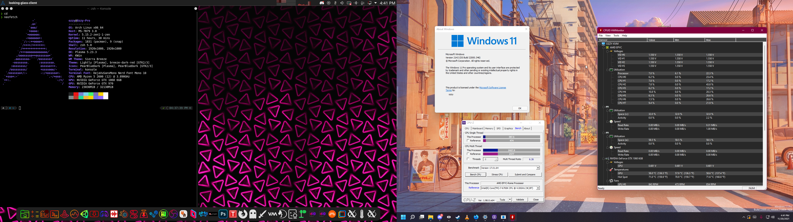

# VFIO Config
#### Config files and thoughts



### Introduction
VFIO Allows people to run Windows for apps that simply can't run in Linux its a good solution for app compatibility its not perfect but it would allow people to run games and apps that will not run in Wine or Steam Proton
the draw back of it is its not the best solution for apps that use anti-cheat software to protect multiplayer experiences


### System Specs
* **Motherboard:** MSI X470 GAMING PLUS MAX
* **CPU:** Ryzen 7 5700G @ Stock
* **RAM:** 2 x 16GB (32GB) @ 2666 MHZ
* **GPU1 (Host):** EVGA GTX 970 4G @ Stock
* **GPU2 (Guest):** Gigabyte GTX 1060 @ Stock
* **Storage:** 1 x 256GB Samsung SSD, 1 x 500GB Crucial SSD, 2 x 3TB Toshiba HDD*
* **OS (Guest):** Windows 11 Pro
* **OS (Host):** Arch Linux running on the Linux Zen Kernel

*Host on the Samsung drive and Guest drives are stored on an SSD and HDD with the other HDD serving as a backup drive.*

### Troubleshooting
### Zen Kernel and ACS Patch
I use the Linux Zen Kernel because it includes the ACS patch for when IOMMU Groups don't wanna work correctly
#### B350-Plus Motherboard
The X470 GAMING PLUS MAX serves as a good option for VFIO,  It's GPU/USB card IOMMU groups are as follows (all groups in the iommu file): 
```
IOMMU Group 12:
        12:00.0 VGA compatible controller [0300]: NVIDIA Corporation GP104 [GeForce GTX 1060 6GB] [10de:1b83] (rev a1)
IOMMU Group 13:
        12:00.1 Audio device [0403]: NVIDIA Corporation GP104 High Definition Audio Controller [10de:10f0] (rev a1)
IOMMU Group 24:
        23:00.0 USB controller [0c03]: Renesas Technology Corp. uPD720201 USB 3.0 Host Controller [1912:0014] (rev 03)
```
The GTX 1060 is fully isolated and works with the VM and the GTX 970 is not 

#### Configuring hardware and dedicated drives
Then a Virtio SCSI controller must be configured in virt-manager ('Add Hardware' -> 'Controller' -> 'SCSI'). Finally, you must go into the vm and install special drivers for the SCSI controller that should show up in Device Manager. Those drivers can be located in the iso here: https://fedorapeople.org/groups/virt/virtio-win/direct-downloads/archive-virtio/virtio-win-0.1.208-1/ .

### Looking Glass
I use looking glass to interface with the VM
Looking Glass is a powerful tool that allows Windows and Linux applications to live side by side, but requires a little extra configuration. (1920x1080) display. if you wanna use it on an ultrawide (2560x1080) display. you need to change the shared memory buffer to 64MB
https://looking-glass.io/
```
size unit='M'>64</size>
```
#### Blue screen upon starting looking-glass-client
A blue screen for looking glass is simply displayed when the client is waiting for the host to start relaying frames. Make sure that the host is correctly configured, and looking-glass-host is running. 
#### IVSHMEM Drivers for Windows 11
The default looking glass drivers are only for Windows 10 and above. The windows drivers are also included in [here](https://fedorapeople.org/groups/virt/virtio-win/direct-downloads/upstream-virtio/). 
